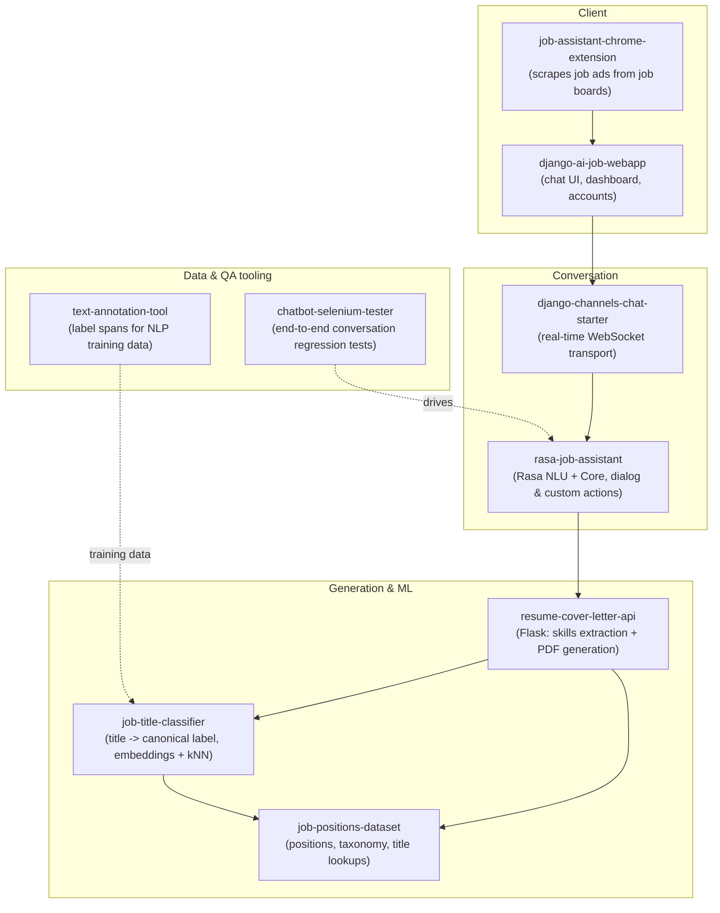

# JobX AI - Platform Overview

> An AI-powered job-application assistant. Users paste a job ad, and the system reconciles the
> job title, extracts the relevant skills, asks position- and industry-specific questions through a
> chat interface, and generates a tailored cover letter and resume as a styled PDF.

This repository is the **map** of the venture. The product was built as a set of focused, independently
deployable components - each lives in its own repository. This overview explains how they fit together,
what each one does, and where the machine-learning / NLP work sits.

The code has been **de-branded for public release**: company names, backend hosts, analytics keys, cloud
account identifiers, and scraped third-party data have been removed or replaced with `YOUR_*` placeholders.
The engineering is intact.

---

## Architecture

---

## Components

| Repository | What it does | Stack |
|---|---|---|
| [job-title-classifier](https://github.com/beimichen/job-title-classifier) | Maps free-text job titles to canonical labels (exact match → kNN vote over averaged word-vectors). Domain-agnostic. | Python, nltk, numpy, scipy |
| [resume-cover-letter-api](https://github.com/beimichen/resume-cover-letter-api) | Flask microservice: skills extraction (RAKE + curated lookups), sentence-template engine, WeasyPrint PDF rendering. | Python, Flask, WeasyPrint |
| [rasa-job-assistant](https://github.com/beimichen/rasa-job-assistant) | Conversational assistant: NLU + dialogue management + custom Python action server. | Python, Rasa, Flask |
| [job-positions-dataset](https://github.com/beimichen/job-positions-dataset) | Open dataset of 3,600+ positions, a 30-industry taxonomy, and title lookups, plus a conversion toolkit. | JSON/CSV, Python |
| [text-annotation-tool](https://github.com/beimichen/text-annotation-tool) | Keyboard-driven desktop GUI for labeling text spans (NER / span classification training data). | Python, Tkinter |
| [django-ai-job-webapp](https://github.com/beimichen/django-ai-job-webapp) | The main web application: chat-driven UI, dashboard, cover-letter tracking, user accounts. | Django, Celery, Redis, Postgres, S3 |
| [django-channels-chat-starter](https://github.com/beimichen/django-channels-chat-starter) | Real-time, room-based WebSocket chat transport. | Django Channels, Redis, Daphne |
| [job-assistant-chrome-extension](https://github.com/beimichen/job-assistant-chrome-extension) | Browser extension with pluggable parsers that scrape job ads from major boards. | JavaScript, Webpack |
| [chatbot-selenium-tester](https://github.com/beimichen/chatbot-selenium-tester) | Drives a real browser through chat conversations to catch conversational regressions at scale. | Python, Selenium |

---

## Where the ML / NLP work lives

- **Title reconciliation** ([job-title-classifier](https://github.com/beimichen/job-title-classifier)) - word embeddings,
  k-nearest-neighbors classification over averaged token vectors, with an exact-match fast path.
- **Skills & keyword extraction** ([resume-cover-letter-api](https://github.com/beimichen/resume-cover-letter-api)) -
  RAKE keyword extraction combined with curated skill lookups to tailor generated text to a specific ad.
- **Conversational AI** ([rasa-job-assistant](https://github.com/beimichen/rasa-job-assistant)) - intent
  classification, entity extraction, and dialogue management with a custom action server.
- **The data pipeline behind it** - a [labeled dataset](https://github.com/beimichen/job-positions-dataset) and a
  purpose-built [annotation tool](https://github.com/beimichen/text-annotation-tool) for producing NLP training data,
  with [automated conversation testing](https://github.com/beimichen/chatbot-selenium-tester) closing the loop.

---

## Team

JobX AI was built as a startup venture by **Bei Mi Chen**, **Danny Blaker**, and **Lane McDonald** (2019).
All component repositories are released under the MIT License.
